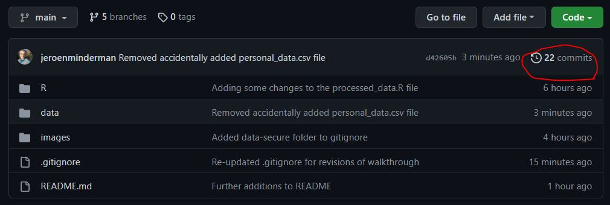
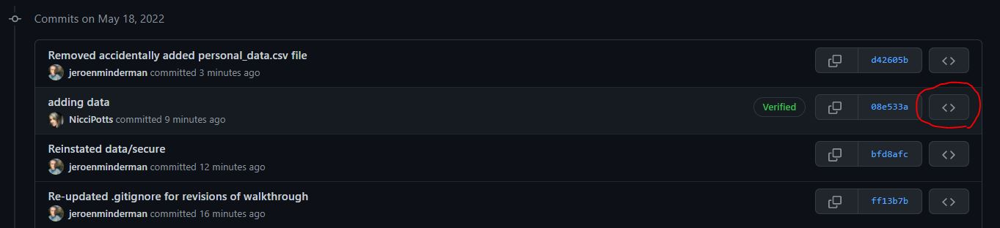
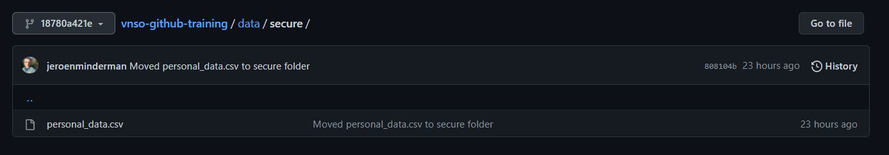

# vnso-github-training
A repository to hold some introductory training support, tutorials and materials for Git/Github for VNSO

# Removing sensitive data from repositories

1. [Introduction](#introduction)
2. [Note on the use of CLI commands in this walkthrough](#cli)
3. [Finding sensitive data file, removing locally, and pushing](#removeandpush)
4. [.gitignore to avoid commiting specific files or folders](#gitignore)
5. [Rewriting repo history to permanently remove specific files](#historyrewrite)
6. [Caveats](#caveats)
7. [Exercise](#exercise)

## Introduction<a id="introduction"></a>

Once local changes or additions are "pushed" to a remote repository, they become part of the remote's history and are therefore not easily removed permanently.  
This can become an issue if we need to deal with data files that contain sensitive or personal data that have erroneously been committed and pushed to a repository.  
  
This repository provides a "toy" example of such a case with a dummy sensitive data file previously uploaded to `data/secure/`.  

We will use the history of this repository to demonstrate:  

- Even if a file has been previously removed locally and changes pushed to a repo, the file can be retrieved online by browsing the remote's history
- A simple means to ensure files in certain local directories will not be accidentally uploaded to the repository (using `.gitignore`); as well as the limitations of doing that.
- One method to remove such files _permanently_ and rewrite the repository's history to ensure it cannot be retrieved in the remote.

>## Note on the use of CLI commands in this walkthrough <a id="cli"></a>
>Throughout this walkthrough, we use and illustrate Command Line Interface (CLI) commands to perform all local operations such as adding and removing files, committing to Git and pushing to Github. Note that most of these operations can also be done through various IDE interfaces (e.g. Windows File Explorer for file operations, and Git actions through e.g. the RStudio IDE interface). However, there are limits to the IDE option, and getting used to using the CLI for this purpose is recommended - for example the key `git filter-repo` command as described below is likely not implemented in any IDE.  
In this walkthrough, wherever we present a code block that looks like this - 
>```
> git log
>```
>We assume this to mean commands that are entered into a CLI prompt (`>`), ___in the root of the Git repository we are working on___. There are various options for this depending on your operating system, e.g. [bash](https://www.freecodecamp.org/news/linux-command-line-bash-tutorial/) on Linux, [Terminal](https://support.apple.com/en-gb/guide/terminal/welcome/mac) in MacOS, and [git-bash](https://www.atlassian.com/git/tutorials/git-bash) on Windows. Note that RStudio has a built-in terminal interface which you can use in place of this for convenience.  
A publicly available introduction to CLI (third party) can be found [here](https://blog.testproject.io/2021/03/30/a-beginners-guide-to-command-line-interface-cli/) and [here](https://www.atlassian.com/git/tutorials/git-bash). 

## Finding sensitive data file, removing locally, and pushing <a id="removeandpush"></a>

Note that in the current (most recent) state of the repository, the sensitive file in question (`data/secure/personal_data.csv`) has already been removed locally and this change has been pushed to the remote repository.

We can see the commit history for the repository by going to "commits" at the top of the file list under the Code tab:


  
We can look at the state of the repository at previous commits by clicking on the <> buttons, "Browse the repository at this point in the history":  


  
Going down to commit [#08e533a](https://github.com/Vanuatu-National-Statistics-Office/vnso-github-training/commit/08e533a64ec1d3a7afc748332cd227a6d0e88ed5), we can see that at that point the repo had a file `data/secure/personal_data.csv`:  

  
  

From this point onwards, this file was removed locally and the changes pushed to the remote repository.

```{console}
> rm data/secure/personal_data.csv
> git add data/secure/personal_data.csv
> git commit -m "Oops I added a file that shouldn't be included, I have now removed it locally"
> git push
```

This resulted in commit [#d42605b](https://github.com/Vanuatu-National-Statistics-Office/vnso-github-training/commit/d42605bb65c9d2d35edeb35cf280f3f7bf6e2cd0); where the file in question no longer exists.  
However, it is important to stress that as per the above, all that is needed to retrieve the deleted file is to go to the history, browse the commit before the file was deleted, and viewing or downloading its source - in a public repository anyone could do this.
Indeed, in your local repository you can "checkout" any of the previous commits, which allows you to browse previous versions of the working directory, using the following CLI commands:

```{console}
> git checkout 08e533a
> ls data/secure
```
This should show the file as being present (at this point in the history). 

> Note that after you've "checked out" a previous commit, you are no longer working on the most recent (`HEAD`) of the repository (you will see a warning related to this when you checked out the commit as above). 

To switch the local repository back to the most current state:

```{console}
> git switch -
```

## .gitignore to avoid commiting specific files or folders <a id="gitignore"></a>

The `.gitignore` file in the root of a git repository is essentially a list of rules of specific files, file types, directories or file patterns that will always be excluded from any commits.  
Any references to files or directory names in this list will not be included in any commits _from the point they are added to the list_.
Format of this file is really quite straightforward but some further details and examples can be found [here](https://www.atlassian.com/git/tutorials/saving-changes/gitignore), for example.

Note that until the contents of the `data/secure` folder are added to the `.gitignore` file, it is easy to add new files to this folder and accidentally include them in commits pushed to the remote repository.
To address this, we can add the whole of the the `data/secure/` folder to the `.gitignore` file, by adding the line

```
data/secure/*
```

to the `.gitignore` file, and committing and pushing that change. Note the /* at the end of the line above - this is crucial to ensure the _entire contents_ of this folder is ignored, rather than just a single file.

With this new change to the `.gitignore`, we can add any files we like to this folder in our _local_ repository, but these changes will not be added to any commits, avoiding accidental commits of these.  
To illustrate, we can add a new sensitive file:

```
> touch data/secure/new_data_kept_locally.csv
```
Running `git status`, `git add .` and `git commit -m "Added data to data/secure/ folder"` now reports that nothing has been added to the repository - because the folder `data/secure` and all its content are being ignored.

```
> git add .
> git commit -m "Added data to data/secure/ folder"

On branch building_history
Your branch is up to date with 'origin/building_history'.

nothing to commit, working tree clean

```
This gives a good way to work with sensitive data locally while keeping this out of the remote repository.
In a directory structure that splits `data/open` and `data/secure`, it is good practice to ensure the latter folder is always included in the `.gitignore` file from the start of any work on the repository.  
__It is also important to stress that if this addition is made to the `.gitignore` file _after files had already been included in that folder_, these files are still recoverable through the repository history as detailed above.__ In the following section we give one potential way to address this.

## Rewriting repo history to permanently remove specific files <a id="historyrewrite"></a>

To permanently erase a file from a repository, so it is no longer present in the history, we need to essentially re-write the repository history. In effect, we need to go through each commit and "rebuild" the repository to remove all evidence of the file.  
There are several ways to do this and we cannot go into all of them - for reference the [Git/Github documentation](https://docs.github.com/en/authentication/keeping-your-account-and-data-secure/removing-sensitive-data-from-a-repository) gives a lot more detail. 

The method we use here is the `git filter-repo` command. This essentially iteratively rebuilds the repo history to remove everything relating to the given file.  
Note that this assumes that the actual file has already been removed locally from the repository (if you want to keep it, you may have to temporarily remove it and add it back in after you've run `git filter-repo` and added the folder to the `.gitignore` file as above):
```
> rm data/secure/personal_data.csv
```
The `git filter-repo` command assumes you are working on a "fresh clone" of the respository - this is presumably to avoid any issues with unsaved changes and/or avoid critial merge conflicts with others that may be working with the same remote repository. In the command below this is bypassed by the addition of the `--force` argument, but note that a real life condition you might want to avoid using this.

```
> git filter-repo --force --invert-paths --path data/secure/personal_data.csv
Parsed 20 commitsHEAD is now at e49f111 Further additions to README
Enumerating objects: 62, done.
Counting objects: 100% (62/62), done.
Delta compression using up to 8 threads
Compressing objects: 100% (56/56), done.
Writing objects: 100% (62/62), done.
Total 62 (delta 18), reused 1 (delta 0), pack-reused 0

New history written in 0.37 seconds; now repacking/cleaning...
Repacking your repo and cleaning out old unneeded objects
Completely finished after 0.99 seconds.

```
If you now inspect the `git log` for the repository and pick one that should include the `personal_data.csv` file, you will see that the data is no longer available even if you checkout that commit. The only file present is the one that is only kept locally (not committed because of `.gitignore`.) _(note that the history log and commit references given here will not be entirely correct any more, but illustrate the process)_

```
git log --oneline
e49f111 (HEAD -> building_history) Further additions to README
b3f65aa Added some text around .gitignore to walkthrough
3e9492b Added data-secure folder to gitignore
649790e Continuing tutorial text in README, added some images
721f61b Started writing tutorial in README.md
115af2c Adding some changes to the processed_data.R file
33f5448 Added initial data file to data/open/
e35920d Adapted read_csv call to reflect new directory structure
7451488 (main, backup_working) Cleaning up some local merge issues
79c8c46 Merge branch 'main' of https://github.com/Vanuatu-National-Statistics-Office/vnso-github-training
6c2ba53 Merge pull request #1 from Vanuatu-National-Statistics-Office/data-upload
5a43281 Revert "Edited README, added .vscode/ to gitignore"
c53bdf8 (data-upload) add R code
acf98b1 add data
6ed1192 (jeroen_old) Edited README, added .vscode/ to gitignore
2aa5ae0 Initial commit

> git checkout dc76849
Note: switching to 'dc76849'.

You are in 'detached HEAD' state. You can look around, make experimental
changes and commit them, and you can discard any commits you make in this
state without impacting any branches by switching back to a branch.

HEAD is now at dc76849 Moved personal_data.csv to  secure folder

> ls data/secure
new_data_kept_locally.csv

```

We switch back to the most current repo state:

```
git switch -
```

It is important to now push all these commit re-writes to the remote repository, including all change:

```
> git push --force --all
Enumerating objects: 58, done.
Counting objects: 100% (58/58), done.
Delta compression using up to 8 threads
Compressing objects: 100% (38/38), done.
Writing objects: 100% (58/58), 104.70 KiB | 52.35 MiB/s, done.
Total 58 (delta 14), reused 56 (delta 14), pack-reused 0
remote: Resolving deltas: 100% (14/14), done.
To https://github.com/Vanuatu-National-Statistics-Office/vnso-github-training.git
 + f86940d...e49f111 building_history -> building_history (forced update)
 + 29d7297...c53bdf8 data-upload -> data-upload (forced update)
 + 7191755...7451488 main -> main (forced update)

```

## Caveats <a id="caveats"></a>

It should be noted that even once the steps above have been taken, it is possible that the sensitive file in question remains available and present in third party clones or forks of the repository.  

For this reason, as much as possible, it is advisable to work with anyone holding local clones or forks of the repository to ensure the sensitive data is also removed from their local clones. The easiest and most "belt and braces" approach to this would be to ___ask all collaborators to re-clone the repository___. This may mean that they will lose some previously uncommitted changes; to some extent this is inevitable. Another option is to "rebase" their local copy - more information on this can be found [here](https://docs.github.com/en/authentication/keeping-your-account-and-data-secure/removing-sensitive-data-from-a-repository#fully-removing-the-data-from-github). 

More broadly speaking, it is important to stress that while the above approach deals with the immediate issue of sensitive data being potentially publicly available (given the caveat above), ___this should be seen as a damage limitation strategy only__. Any sensitive data having been committed to a public repository at any point should be considered a data breach, that should be dealt with by whatever relevant organisational procedures.

## Exercise <a id="exercise"></a>

1. [Fork](https://docs.github.com/en/get-started/quickstart/fork-a-repo) this repository into another Github account (e.g. your own).
2. [Clone](https://docs.github.com/en/enterprise-server@3.5/repositories/creating-and-managing-repositories/cloning-a-repository) the forked repository to your local computer.
3. Confirm `data/secure/*` is not included in the `.gitignore` file; if it is, remove it from the file.
4. In your locally forked copy, copy the file `data/open/some_random_data.csv` to `data/secure/more_personal_data.csv`, add, commit and push this file to your remote forked repository.
5. You now have a situation where you have a "dummy" sensitive data file in the `data/secure/` folder - now follow the steps above to (1) remove the `more_personal_data.csv` file locally, (2) re-add `data/secure/*` to your `.gitignore` file, (3) push the changes to your remote repository, (4) in the remote repository you should be able to confirm the file is no longer present but still visible in the repository history, (5) perform the `git filter-repo` action [as described above](#historyrewrite) and push your cleaned history to your remote repository, (6) confirm you can no longer find `more_personal_data.csv` file in the repository history.

